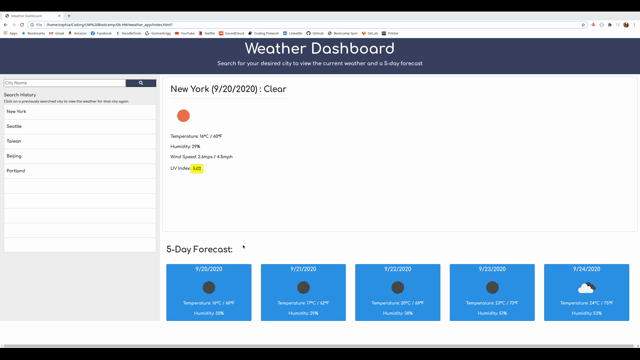
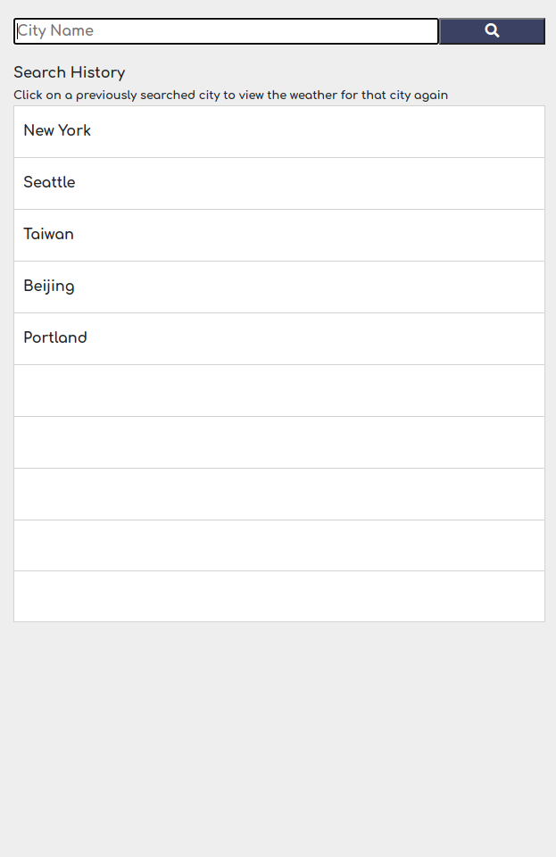
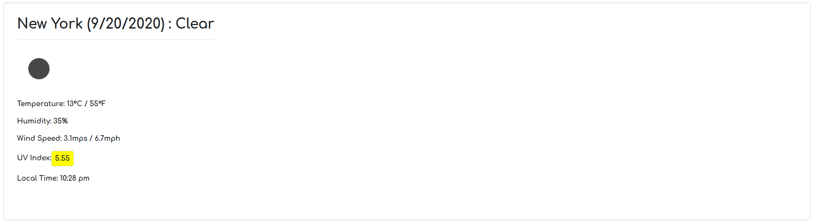
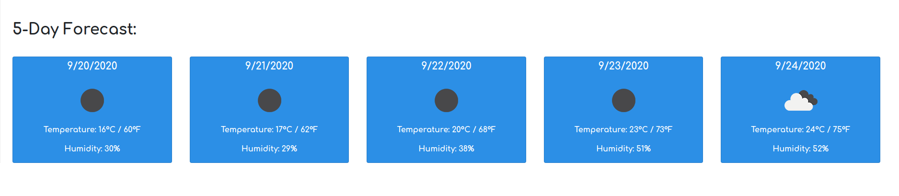

# Weather Dashboard

## Description 

This repository consists of an HTML, JavaScript, and CSS file. The HTMl file holds the skeletal framework of the page, the CSS file styles the page, and the JavaScript file provides the functionality to the weather dashboard (i.e. click events, localStorage, etc.).

This page holds a weather application/dashboard. It allows the user to input a city of their choosing and then displays the current weather and a 5-day forecast. The current weather information includes a general description, the date, a relevant weather icon, humidity, temperature, wind speed, local time, and UV index. The 5-day forecast weather information includes the date, a relevant weather icon, temperature, and humidity. Once a city is searched, it is logged to the localStorage and displayed in the "Search History" section of the page. Previously searched cities' weather can be displayed again by simply clicking on the city name in the "Search History" section.

This project focuses on the usage of localStorage, dynamically creating HTMl elements, jQuery, and server side API's. The API used in this project was Open Weather Map API (https://openweathermap.org/api).

## Acess and Installation

This project can be accessed either via the GitHub Repository page or the deployed public page. 

- [GitHub Repository](https://github.com/sophia2798/API_quiz)
- [Deployed Page](https://sophia2798.github.io/weather_app/)

To open and edit code files, you will need a text editor. The one used to create this page was Visual Studio Code (https://code.visualstudio.com/).

To install this repository, you can git clone the repository using the green "Code" button. You can copy and paste either the HTML or SSH URL.

## Usage

This page can be used to view the weather for the current day and the next five days. It may be limited in its ability to differentiate between cities with the same name. Adding that functionality, which would require the use of additional parameters in the API, could be a useful addition to the existing code. 

This project can also be used as a template to learn more about making API calls, retrieving and storing information in localStorage, dynamically creating HTML elements, and jQuery. All these concepts were used together in this code to allow for the search history to be logged and for the unique weather information to display depending on the city. 

## Features 

- A search section that includes a search form, a search button with an icon, and a search history table. 

- A current weather section that displays the date, a general weather description, an icon, temperature, humidity, wind speed, local time, and the UV Index. Additionally, the UV Index is color coded depending on the condition (Green - Favorable, Yellow - Moderate, and Red - Dangerous).

- A 5-day forecast section that displays the date, icon, temperature, and humidity for the next five days. 

- Upon refresh, the page will also display the weather information for the last searched city. 

## Authors

- Sophia Jung - [GitHub Profile](https://github.com/sophia2798)
- UW Coding Bootcamp/Trinity Education Services

## Credits

- [W3 Schools](https://www.w3schools.com/default.asp) 

- [Stack Overflow](https://stackoverflow.com/)

- [Open Weather Map API](https://openweathermap.org/api)

- [jQuery](https://developers.google.com/speed/libraries#jquery)

- [Bootstrap](https://getbootstrap.com/docs/4.5/getting-started/introduction/)

- [Google Fonts](https://fonts.google.com/)

- [Moment.js](https://momentjs.com/)